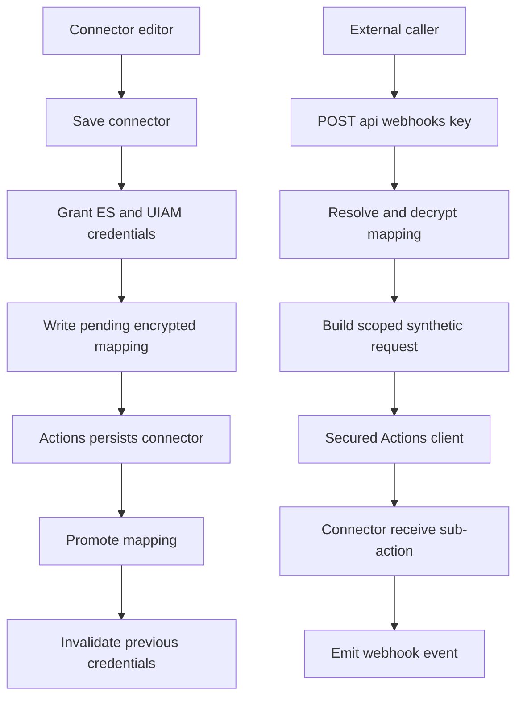

# Inbound webhook MVP build plan

## Goal

Ship the smallest production-safe inbound webhook feature that works in
stateful and Serverless Kibana:

1. A user creates an **Inbound Webhook** connector.
2. The connector UI generates a URL:

   ```text
   https://<kibana-host>/<base-path>/api/webhooks/<uuid>
   ```

3. An external JSON `POST` invokes the connector.
4. The connector calls `emitEvent('webhook', payload)` using the privileges of
   the latest user who successfully saved the connector.

Trigger registration and workflow consumption are intentionally deferred. Until
another change registers/supports the `webhook` trigger, `emitEvent` fails as
unregistered and the public endpoint returns its delivery-failure response.

The detailed target architecture remains in
[`inbound_webhook_idea.md`](./inbound_webhook_idea.md). This document defines
the reduced first implementation.

## MVP scope

### Included

- User-created `.workflows-inbound-webhook` connector owned by
  `workflows_management`.
- Generated UUID webhook URL stored in connector secrets.
- Hidden, space-scoped Encrypted Saved Object mapping URL-key hash to connector
  ID and delegated credentials.
- ES API keys for stateful deployments.
- ES and UIAM credentials for Serverless.
- Credential rotation to the current editor on every connector save.
- Anonymous JSON webhook route with fixed `receive` sub-action.
- Synthetic user-scoped `KibanaRequest` and normal secured Actions client.
- Producer-only `emitEvent('webhook', payload)` call with the same user scope.
- Basic connector status so the UI can confirm credential promotion.
- Cleanup of abandoned pending credentials and connector deletion.

### Deferred

- Revealing an existing webhook URL after creation.
- User-triggered URL rotation.
- `Idempotency-Key` delivery records.
- Custom per-key distributed rate-limit policies beyond Kibana's platform route
  limiter.
- Advanced health repair UI and automatic repair.
- Connector copy/import/move between spaces.
- Binary, form, or multipart payloads.
- Configurable payload schemas per connector.
- Delivery history UI and detailed webhook analytics.
- Workflow trigger schema/registration.
- Workflow YAML subscription syntax, connector matching, KQL filtering, and
  workflow scheduling.

Deferred features must fail safely. In particular, connector export/copy is
disabled rather than copying credentials, and a failed promotion leaves the
webhook unavailable rather than falling back to stale credentials.

## MVP data flow



## Contracts

### Connector

```ts
export const InboundWebhookConnectorTypeId = '.workflows-inbound-webhook';

interface InboundWebhookConfig {
  webhookKeyHash: string;
  credentialRevision: string;
}

interface InboundWebhookSecrets {
  webhookUrl: string;
}

interface ReceiveWebhookParams {
  subAction: 'receive';
  subActionParams: {
    eventId: string;
    credentialRevision: string;
    body: Record<string, unknown>;
    query: Record<string, string | string[]>;
    headers: Record<string, string>;
    receivedAt: string;
  };
}
```

### Emitted event

```ts
interface InboundWebhookEvent {
  connectorId: string;
  eventId: string;
  body: Record<string, unknown>;
  query: Record<string, string | string[]>;
  headers: Record<string, string>;
  receivedAt: string;
}
```

### Encrypted mapping

```ts
interface InboundWebhookSavedObject {
  payload: {
    connectorId: string;
    connectorTypeId: '.workflows-inbound-webhook';
    status: 'pending' | 'active';
    targetWebhookKeyHash?: string;
    credentialRevision: string;
    apiKeyId: string;
    uiamApiKeyId?: string;
    delegatedUsername?: string;
    delegatedUserProfileId?: string;
    createdAt: string;
    updatedAt: string;
    secrets: {
      apiKey: string;
      credentialVersion: number;
      uiamApiKey?: string;
    };
  };
}
```

Active object ID is `SHA-256(webhookKey)`. Pending object ID is
`pending:<connectorId>:<credentialRevision>`.

## Implementation order

### 1. Register encrypted storage

Files:

- `src/platform/plugins/shared/workflows_management/kibana.jsonc`
- `src/platform/plugins/shared/workflows_management/server/saved_objects/inbound_webhook.ts`
- `src/platform/plugins/shared/workflows_management/server/storage/inbound_webhook_mapping_repository.ts`
- registration wiring in
  `src/platform/plugins/shared/workflows_management/server/plugin.ts`

Tasks:

1. Add `encryptedSavedObjects` as a required server dependency.
2. Register hidden `workflow_inbound_webhook` saved objects with
   `namespaceType: 'multiple-isolated'` and export/copy disabled.
3. Encrypt only `secrets`; include immutable connector type, connector ID, and
   creation timestamp in AAD.
4. Implement stage, promote, resolve, and delete operations.
5. Use full decrypt/re-encrypt for promotion; never partially update encrypted
   or AAD attributes.
6. Fail connector creation when `canEncrypt` is false.

Done when mappings decrypt only through the ESO internal client and remain
isolated by space.

### 2. Implement delegated credential management

Files:

- `src/platform/plugins/shared/workflows_management/server/services/inbound_webhook_api_key_service.ts`

Tasks:

1. Preflight connector execute and workflow read/execute privileges.
2. Grant a managed ES key with `grantAsInternalUser` for session-authenticated
   editors.
3. Clone API-key-authenticated editor credentials into a framework-managed key.
4. Grant and select UIAM credentials in Serverless using Task Manager's strategy
   as the behavioral reference.
5. Build the correct ES/UIAM authorization header for a synthetic request.
6. Invalidate managed keys after replacement, failed promotion, and deletion.

Done when stateful and Serverless execution produces a scoped request accepted
by Actions and denied for privileges the editor did not have.

### 3. Implement the connector and lifecycle

Files:

- `src/platform/plugins/shared/workflows_management/server/connectors/inbound_webhook/`
- registration in
  `src/platform/plugins/shared/workflows_management/server/plugin.ts`
- `src/platform/plugins/shared/workflows_management/common/connector_sub_actions_map.ts`

Tasks:

1. Register a normal user-created connector with
   `supportedFeatureIds: [WorkflowsConnectorFeatureId]`.
2. Validate config, secrets, and fixed `receive` params.
3. In `preSaveHook`, validate the URL/hash/revision, preflight privileges, grant
   credentials, and stage the pending ESO.
4. In `postSaveHook`, promote matching pending credentials, verify resolution,
   then invalidate the prior keys.
5. On failure, invalidate pending keys and leave no executable stale revision.
6. In `postDeleteHook`, remove active/pending mappings and invalidate keys.
7. In `receive`, reject mapping/config revision mismatch and call
   `emitEvent('webhook', payload)` using `execOptions.request`.

Done when every successful edit changes the delegated principal while
preserving the webhook URL.

### 4. Add the inbound route

Files:

- `src/platform/plugins/shared/workflows_management/server/api/routes/inbound_webhook/post_webhook.ts`
- route registration

Route:

```text
POST /api/webhooks/{webhookKey}
```

Requirements:

- `security.authc.enabled: false`;
- explicit authorization opt-out reason;
- `access: 'public'`;
- `xsrfRequired: false`;
- platform rate limiter remains enabled;
- JSON only, maximum 1 MiB;
- UUID validation and space-scoped SHA-256 lookup;
- identical `404` for unknown, inactive, stale, wrong-space, or wrong-type
  mappings;
- filter authentication, cookie, host, proxy, and forwarding headers;
- construct a synthetic request from decrypted credentials;
- execute only the mapped connector's `receive` sub-action with a generated
  `eventId`;
- return `202` only when `emitEvent` succeeds; while `webhook` remains
  unregistered, return the existing delivery-failure response.

Done when an unauthenticated caller can invoke only the connector encoded by the
URL and cannot choose a connector ID, sub-action, or privilege scope.

### 5. Add the minimal connector UI

Files:

- `src/platform/plugins/shared/workflows_management/public/connectors/inbound_webhook/`
- registration in
  `src/platform/plugins/shared/workflows_management/public/plugin.ts`

Tasks:

1. Generate the UUID once on create with `crypto.randomUUID()`.
2. Build the URL from the browser origin and Kibana/space base path.
3. Submit `secrets.webhookUrl`, `config.webhookKeyHash`, and a fresh
   `config.credentialRevision`.
4. Show a read-only URL and copy button before initial save.
5. On edit, show only "Webhook URL configured"; do not decrypt/reveal it.
6. Explain that every save moves execution privileges to the current editor.
7. After save, query minimal status until the active revision equals connector
   config revision; show success or failure.

MVP does not include URL rotation.

### 6. Add status and cleanup

Files:

- `server/api/routes/inbound_webhook/get_webhook_status.ts`
- `server/tasks/inbound_webhook_cleanup_task.ts`

Tasks:

1. Return only active/updating/degraded/disabled status, revision, version, and
   delegated username.
2. Never return URL, hash, or credentials.
3. Remove expired pending records and invalidate their keys.
4. Retry failed invalidations from a durable cleanup record.
5. Ensure cleanup never invalidates the credentials referenced by the active
   mapping.

MVP repair is performed by saving the connector again.

### 7. Add audit and telemetry

Record:

- connector creation/edit/delete;
- credential grant, promotion, invalidation, and cleanup;
- webhook accepted/denied/rate-limited/event-emission-failed outcomes;
- event ID, connector ID, space, credential version, and safe outcome metadata.

Never record URL, UUID, key hash, credentials, cookies, authorization headers,
or request body.

## MVP acceptance criteria

- Users can create a connector and copy its generated URL.
- The URL secret and delegated credentials are encrypted at rest.
- Anonymous JSON calls can invoke only the connector encoded by the URL.
- Connector execution and `emitEvent` use the delegated user scope.
- The connector emits the local inbound webhook payload with trigger ID
  `webhook`.
- Trigger registration, YAML subscriptions, filtering, and workflow scheduling
  remain explicitly deferred.
- Every successful connector save rotates scope to the current editor.
- Stale mapping revisions cannot execute.
- Cross-space and missing-key calls return indistinguishable `404` responses.
- Stateful ES-key and Serverless UIAM paths are implemented.
- Delete and failed-save cleanup invalidate managed credentials.
- No credentials, webhook UUIDs, or bodies appear in logs or audit events.
